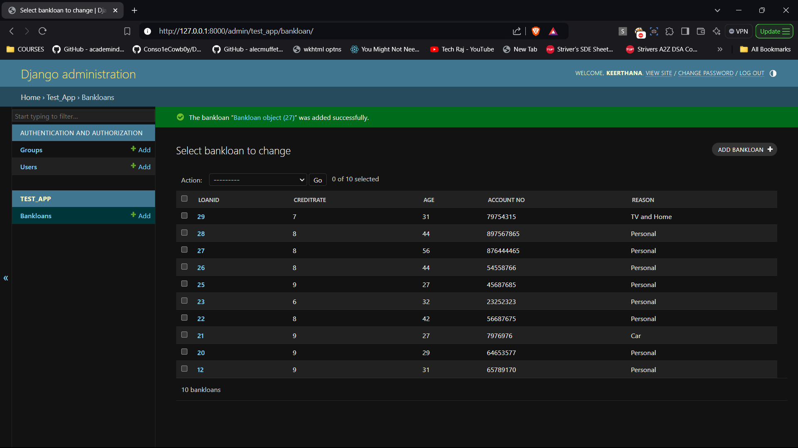

# Ex02 Django ORM Web Application
## Date: 28-09-2024

## AIM
To develop a Django application to store and retrieve data from a bank loan database using Object Relational Mapping(ORM).


## ENTITY RELATIONSHIP DIAGRAM


## DESIGN STEPS

### STEP 1:
Clone the problem from GitHub

### STEP 2:
Create a new app in Django project

### STEP 3:
Enter the code for admin.py and models.py

### STEP 4:
Execute Django admin and create details for 10 books

## PROGRAM
```
admin.py

from django.contrib import admin
from .models import Bankloan, BankloanAdmin  
admin.site.register(Bankloan, BankloanAdmin)

models.py

from django.db import models
from django.contrib import admin

class Bankloan(models.Model):
    Loanid = models.IntegerField(primary_key=True)
    CreditRate = models.IntegerField()
    Age = models.IntegerField()  
    Account_No = models.IntegerField()
    Reason = models.CharField(max_length=500)

class BankloanAdmin(admin.ModelAdmin):
    list_display = ('Loanid', 'CreditRate', 'Age', 'Account_No', 'Reason')
```


## OUTPUT



## RESULT
Thus the program for creating a database using ORM hass been executed successfully
